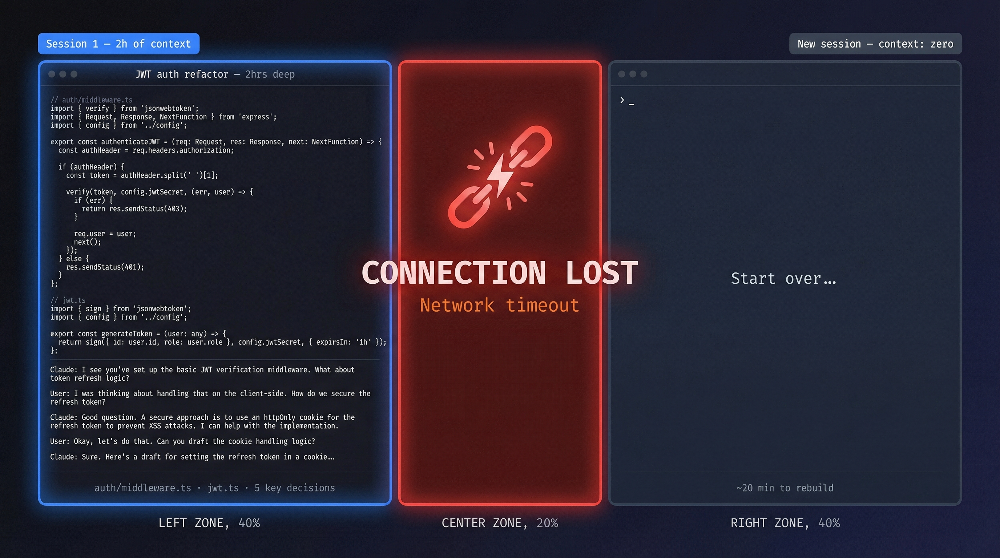
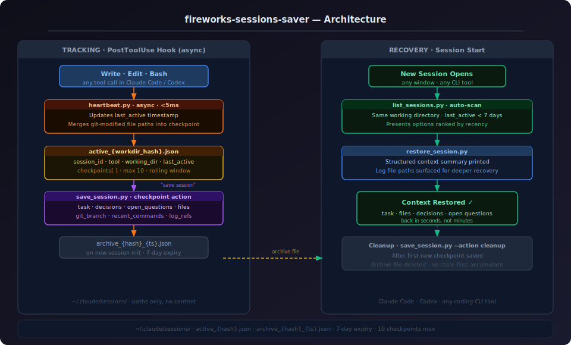
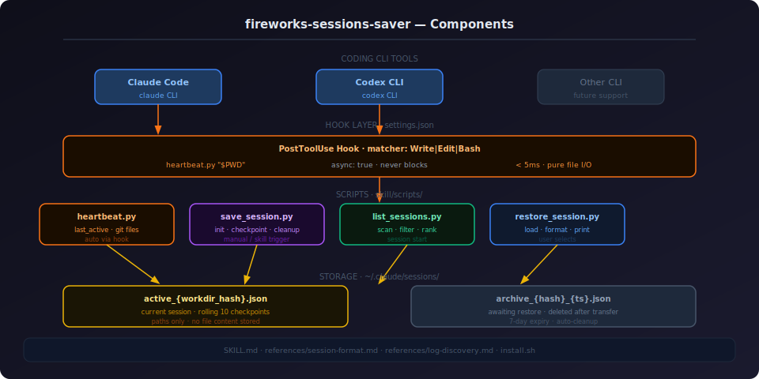
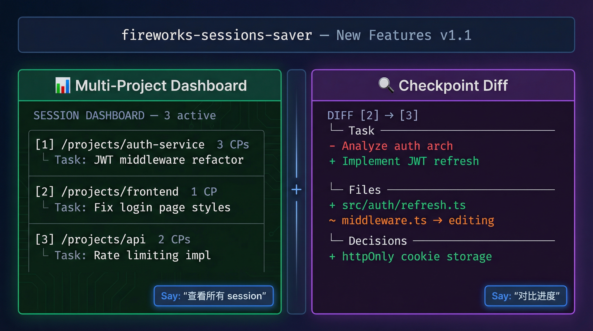

# 你的 AI 编程助手记性有多差？聊聊会话上下文丢失这个被忽视的效率黑洞

每次打开新窗口，都要重新跟 AI 解释一遍"我们在做什么"——这件事你习惯了吗？

---

## 一、AI 编程工具爆发，但有一个问题没人认真解决

过去两年，AI 编程工具的渗透速度超出所有人的预期。Claude Code、Codex、Cursor、Copilot……这些工具已经不是"辅助"了，对很多开发者来说，它们是真正的协作者。你跟它讲需求，它帮你写代码、找 bug、做重构，效率提升是实实在在的。

但有一个问题，几乎所有人都遇到过，却很少被认真讨论：

**会话上下文丢失。**

你正在做一个复杂的 auth 重构，跟 AI 聊了两个小时，建立了完整的上下文——哪些文件在改、为什么这样设计、还有哪些问题没解决。然后网络断了。或者你不小心关了窗口。或者电脑睡眠后 session 超时了。

重新打开，一切归零。

你要重新解释项目背景，重新描述当前任务，重新告诉 AI 哪些文件是关键的。这个过程少则五分钟，多则二十分钟。而且你还得祈祷自己没漏掉什么重要的上下文。

这不是小问题。这是一个每天都在发生的效率黑洞。



---

## 二、这个痛点到底有多痛？

我们来量化一下这件事的成本。

假设你每天用 Claude Code 工作 4 小时，平均每天遇到 2 次会话中断（断网、重启、误关窗口）。每次重建上下文需要 10 分钟。

**每天损失：20 分钟**
**每月损失：约 7 小时**
**每年损失：约 84 小时**

这还只是时间成本。更隐性的成本是：

**认知切换成本。** 重建上下文不只是"再说一遍"，你需要重新进入那个思维状态，回忆当时的决策逻辑，找回那种"在状态里"的感觉。心理学研究表明，深度工作被打断后，平均需要 23 分钟才能完全恢复专注。

**信息损耗。** 你能记住所有的上下文吗？那个"暂时先这样，后面再改"的决定，那个"这个 API 有个坑要注意"的备注，那个还没解决的边界情况——这些细节很容易在重建过程中丢失。

**Token 浪费。** 每次重建上下文，你都在消耗 token 来"喂"AI 背景信息。这些 token 本可以用在真正的工作上。

更糟糕的是，随着 AI 编程工具越来越强大，单次会话的深度也在增加。以前可能聊 20 分钟就能完成一个任务，现在一个复杂任务可能需要持续几个小时的深度协作。会话越深，中断的代价越大。

---

## 三、大家是怎么"解决"这个问题的？

说"解决"其实不准确，大多数人只是在"应对"。

**方案一：手动记笔记。** 在 Notion 或者备忘录里记下当前任务、关键决策、待解决问题。听起来不错，但实际执行率极低——你在专注编程的时候，很少会想到停下来记笔记。而且记笔记本身也是一种上下文切换。

**方案二：在对话框里粘贴背景。** 新窗口打开，把上次的关键信息复制粘贴进去。这个方法有效，但繁琐，而且你需要提前知道"哪些信息是关键的"——而这恰恰是你在深度工作状态下才能判断的事情。

**方案三：不关窗口。** 让 session 一直开着，永远不关。这在实际工作中不现实，而且解决不了断网和崩溃的问题。

**方案四：接受现实。** 大多数人最终选择了这个"方案"。每次重建上下文，当作热身运动。

这些方案的共同问题是：**它们都依赖人的主动行为**。而人在专注工作时，最不擅长的就是主动做这些"元工作"。

真正好的解决方案应该是：**自动的、无感知的、在你需要的时候随时可用的。**

---

## 四、正确的解法：自动持久化 + 结构化恢复

想清楚这个问题的本质，解法其实并不复杂。

我们需要的是一个系统，它能：

1. **自动追踪**：不需要你主动触发，在你工作的过程中静默记录状态
2. **结构化存储**：不只是保存聊天记录，而是提取关键信息——当前任务、涉及文件、关键决策、未解决问题
3. **智能恢复**：新会话开始时，自动检测历史状态，一键恢复上下文
4. **零干扰**：整个过程对工作流没有任何影响

这个思路的关键洞察是：**AI 编程工具本身就有 hook 机制**。每次文件写入、代码执行，都会触发事件。我们可以利用这些事件，在后台静默地更新会话状态。

这就是 `fireworks-sessions-saver` 的核心设计思路。

---

## 五、fireworks-sessions-saver：把会话状态变成持久资产

`fireworks-sessions-saver` 是一个专为 Claude Code 设计的会话状态持久化工具，开源在 GitHub 上。

它的设计哲学很简单：**会话上下文是有价值的资产，不应该因为技术原因丢失。**

### 架构设计

整个系统分为两条链路：



**追踪链路（左侧）：** 通过 Claude Code 的 `PostToolUse` hook，每次 `Write`、`Edit`、`Bash` 调用都会异步触发 `heartbeat.py`，耗时不超过 5ms。它做两件事：更新 `last_active` 时间戳，以及将 git 修改的文件路径合并进 session 文件。当你说"保存进度"时，会写入一个完整的 checkpoint，记录当前任务、关键决策、未解决问题、文件引用、git 分支和日志路径。

**恢复链路（右侧）：** 新 session 启动时，`list_sessions.py` 自动扫描同一工作目录下 7 天内有活动的历史 session。用户选择后，`restore_session.py` 输出结构化上下文摘要。新 session 保存第一个 checkpoint 后，归档文件自动删除，不会积累冗余文件。

### 组件结构



四层架构，职责清晰：

- **CLI 工具层**：Claude Code 是主要支持目标，架构对其他 coding CLI 开放扩展
- **Hook 层**：`settings.json` 中一条 `PostToolUse` hook，异步触发，零影响
- **脚本层**：四个职责单一的 Python 脚本，每个只做一件事
- **存储层**：`~/.claude/sessions/` 下的 JSON 文件，只存路径，不存内容

### 使用方式

安装极其简单，在 Claude Code 对话框里说一句话：

> "从 https://github.com/yizhiyanhua-ai/fireworks-sessions-saver 安装 fireworks-sessions-saver"

安装完成后，一切自动运行。你不需要改变任何工作习惯。

想保存一个完整的 checkpoint？说"保存进度"。
新窗口想恢复上次的状态？说"恢复会话"。

就这么简单。

---

## 六、最新功能：多项目看板 + Checkpoint Diff

最近刚上线了两个新功能，解决了多窗口工作场景下的痛点。



**多项目看板（Dashboard）**

如果你同时开着多个项目的 Claude Code 窗口，现在可以一眼看清所有活跃 session 的状态：

```
SESSION DASHBOARD  —  3 session(s) found

  ACTIVE  (3)

  [1] 2026-04-08 22:49 (just now)  —  claude-code
      Dir:   /projects/auth-service
      Task:  重构 JWT 中间件
      CPs:   3  ·  Files: 5

  [2] 2026-04-08 21:30 (1h ago)  —  claude-code
      Dir:   /projects/frontend
      Task:  修复登录页面样式问题
      CPs:   1  ·  Files: 2
```

说"查看所有 session"或"多项目看板"即可触发。

**Checkpoint Diff**

想知道从上次保存到现在，到底改了什么？Checkpoint diff 功能可以精确对比任意两个 checkpoint 之间的变化：

```
CHECKPOINT DIFF  [2] → [3]

── Task ──────────────────────────────────────
  - 分析现有 auth 架构
  + 实现 JWT refresh token 逻辑

── Files ─────────────────────────────────────
  + src/auth/refresh.ts  [created]
  ~ src/auth/middleware.ts  reference → editing

── Key Decisions ─────────────────────────────
  + refresh token 存储在 httpOnly cookie 中
```

说"对比进度"或"checkpoint 差异"触发。

---

## 七、一些设计细节值得关注

**为什么用 JSON 而不是数据库？**

轻量、可读、无依赖。session 文件可以直接用文本编辑器打开查看，也方便调试和手动修改。

**为什么只存路径不存内容？**

隐私和安全。你的代码内容不应该被存储在一个额外的地方。路径已经足够让 AI 在恢复时重新读取文件内容。

**7 天过期策略是怎么考虑的？**

超过 7 天的 session，上下文的时效性已经很低了。代码可能已经大幅变化，继续恢复反而会引入混乱。7 天是一个经验值，在实际使用中覆盖了绝大多数"我昨天/上周在做什么"的场景。

**SessionStart hook 的价值**

最新版本加入了 `SessionStart` hook，每个新窗口启动时自动 init session。这意味着你不需要手动触发任何操作，所有窗口都会被自动追踪，dashboard 里能看到完整的多项目视图。

---

## 八、写在最后

AI 编程工具正在快速进化，但有些基础设施问题还没有被认真对待。会话上下文持久化就是其中之一。

这不是一个很性感的功能，但它每天都在影响你的工作效率。就像版本控制一样——在有 git 之前，大家也都"活下来了"，但有了 git 之后，你很难想象没有它的工作方式。

`fireworks-sessions-saver` 现在还很早期，但核心机制已经稳定可用。如果你每天都在用 Claude Code，值得花五分钟试一试。

项目地址：https://github.com/yizhiyanhua-ai/fireworks-sessions-saver

欢迎 PR，也欢迎在 issue 里聊聊你遇到的会话上下文问题。

---

*Python 3.9+ · macOS/Linux · MIT License*
